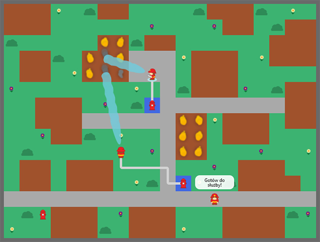

# Strażacy

Gra 2D tworzona w języku JavaScript, oparta o biblioteki React.js i Redux.

Demo online jest dostępne [tutaj](https://mickrzyzak.github.io/fireman-game/).

## Rozgrywka

Rozgrywka będzie składała się z zestawu fabularyzowanych misji, których celem będzie realizowanie wyznaczonych zadań. Gracz będzie mógł kontrolować zastępy straży pożarnej w celu opanowania rozprzestrzeniającego się ognia.

## Zaimplementowane funkcjonalności

* Konsola deweloperska

* Zapisywanie i odczytywanie stanu mapy

* Algorytm wyszukiwania ścieżki

* Podążanie postaci po wyznaczonej ścieżce

* Symulacja rozprzestrzeniania się ognia

* Źródła pozyskiwania wody

* Węże przyłączeniowe

* Gaszenie pożarów

* Dialogi w chmurkach

## Elementy wizualne

* Strażak z animacjami

* Cząsteczkowe animacje dymu i ognia

* Animacja strumienia wody

* Elementy otoczenia: hydrant, krzak, kwiaty

## W planach 😄

* Interfejs użytkownika

* Misje pseudo-fabularne

* Grafiki domów i otoczenia

* Efekty dźwiękowe

## Skróty klawiszowe

    v - przełączanie wyświetlania warstwy wizualnej  
    d - przełączanie wyświetlania typów bloków

## Lista komend

    /savemap
    /select torch
    /select add-fireman

Typy bloków

    /select [wood/brick/asphalt/water]

Elementy wizualne

    /select erase
    /select [hydrant/bush/flower/tree]

## Wersja
0.51
